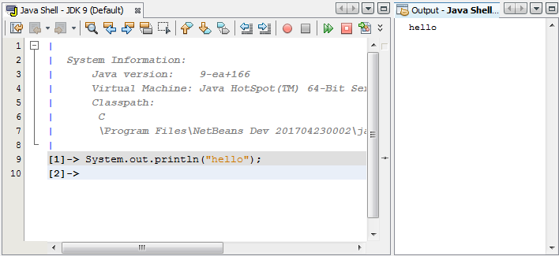
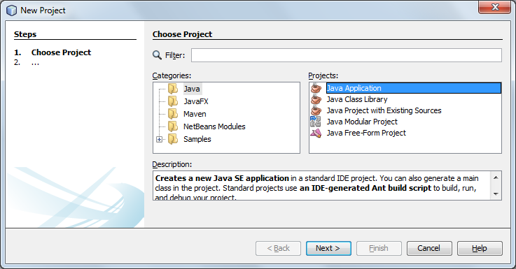
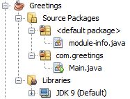
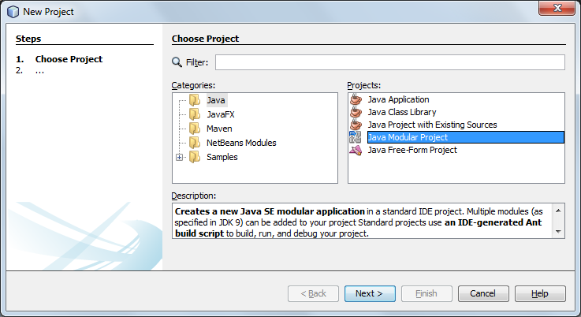
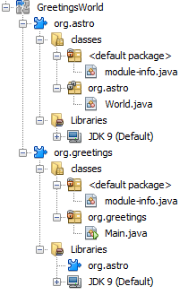
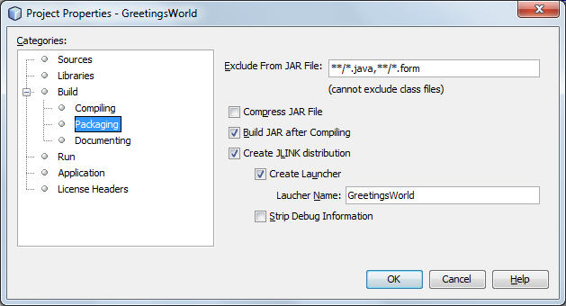
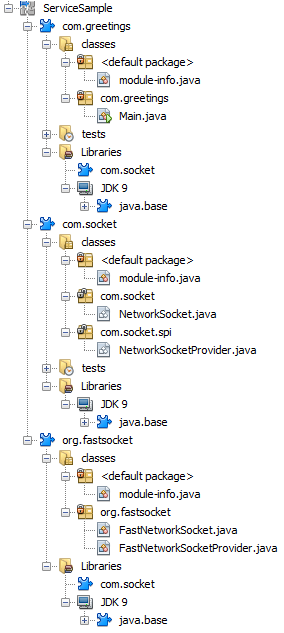
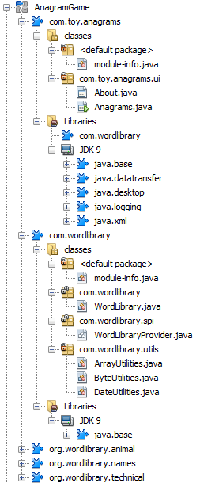

# Workshop: "Diving into the Newest Jigsaw and Java 9 Features"

## Overview

Note: USB sticks will be provided containing the software described in step 1 and 2 below.

   1. Download the latest JDK 9 EA Release (currently jdk-9+166) for your operating system:
http://jdk.java.net/9/
   1. Download the latest NetBeans IDE development build: 
http://bits.netbeans.org/download/trunk/nightly/latest/
   1. In "netbeans.conf", point "netbeans_jdkhome" to the location of the JDK installation:
e.g., "C:\Program Files\Java\jdk-9"
   1. Start NetBeans IDE.
   1. Areas to play with that relate to JShell, Jigsaw, and JLink.
      - http://cr.openjdk.java.net/~mr/jigsaw/spec/lang-vm.html
      - http://cr.openjdk.java.net/~rfield/tutorial/JShellTutorial.html
      - http://openjdk.java.net/projects/jigsaw/quick-start
      - https://github.com/NetBeansDay/JigsawJavaModularProjectSamples
   1. Related reading.
      - https://www.meetup.com/Londonjavacommunity/events/238769022/
      - http://javapapo.blogspot.nl/2017/04/java-9-module-system-jigsaw-ljcs.html
      - https://developer.jboss.org/blogs/scott.stark/2017/04/14/critical-deficiencies-in-jigsawjsr-376-java-platform-module-system-ec-member-concerns
      - https://blog.plan99.net/is-jigsaw-good-or-is-it-wack-ec634d36dd6f

Some tasks to get your feet wet are outlined below.

You won't be able to do all the suggested tasks below in an hour, just pick one or two that you find most interesting.

## JShell

Read: http://cr.openjdk.java.net/~rfield/tutorial/JShellTutorial.html

Go to Tools | Open Java Platform Shell.

</img>

Enter some Java statements and press Enter. The Output window (Ctrl-4) shows the results.

Use:
   * Code completion (Ctrl-Space).
   * Tweak the Java Shell Fonts & Colors in Tools | Options.
   * Right-click in the Java Shell and choose "text|x-repl|Save to Class".
   * Files.lines(Paths.get("&lt;path-to-file-with-lines&gt;")).forEach(s -> System.out.println(s));

## Jigsaw

Read: http://openjdk.java.net/projects/jigsaw/quick-start#greetings

Use the "Greetings" instructions above together with the "Java Application" project template:

</img>

</img>

Read: http://openjdk.java.net/projects/jigsaw/quick-start#greetingsworld

Use the "Greetings world" instructions above together with the new "Java Modular Project" project template:

</img>

</img>

## JLink

Read: http://openjdk.java.net/projects/jigsaw/quick-start#linker

Right-click a project, go to Properties | Packaging and select 'Create JLINK distribution':

</img>

Build the project, switch to the Files window (Ctrl-2), and see the result:

</img>

## Jigsaw Services

Read: http://openjdk.java.net/projects/jigsaw/quick-start#services

Try to reproduce the Services scenario discussed above, i.e., as follows:

</img>

Similarly, modulerize the Anagram Game (i.e., the original unmodulerized version of the Anagram Game is in the Samples category of the New Project dialog):

</img>

For troubleshooting, the result is here: https://github.com/NetBeansDay/JigsawJavaModularProjectSamples

