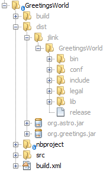

# Workshop: "Diving into the Newest Jigsaw and Java 9 Features"

## Overview

Note: USB sticks will be provided containing the software described in step 1 and 2 below.

   1. Download the latest JDK 9 EA Release (currently jdk-9+166) for your operating system:
http://jdk.java.net/9/
   1. Download the latest NetBeans IDE development build: 
http://bits.netbeans.org/download/trunk/nightly/latest/
   1. In "netbeans.conf", point "netbeans_jdkhome" to the location of the JDK installation:
e.g., "C:\Program Files\Java\jdk-9"
   1. Start NetBeans IDE.
   1. Areas to play with relate to Jigsaw, JLink, and JShell.
      - http://openjdk.java.net/projects/jigsaw/quick-start
      - https://github.com/NetBeansDay/JigsawJavaModularProjectSamples

## JShell

Go to Tools | Open Java Platform Shell.

</img>

## Jigsaw

Read: http://openjdk.java.net/projects/jigsaw/quick-start#greetings

</img>

## JLink

Read: http://openjdk.java.net/projects/jigsaw/quick-start#linker

Right-click a project, go to Properties | Packaging:

</img>

Build the project, switch to the Files window (Ctrl-2), and see the result:

</img>

## Jigsaw Services

Read: http://openjdk.java.net/projects/jigsaw/quick-start#services

Examine the samples: https://github.com/NetBeansDay/JigsawJavaModularProjectSamples

